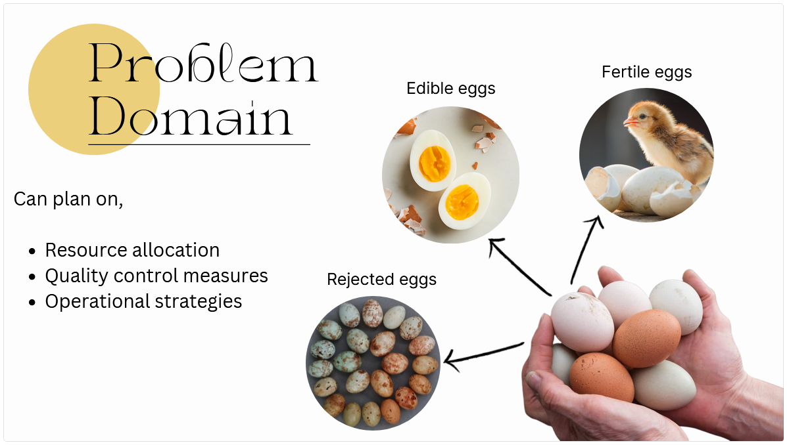

[comment]: # "This is the standard layout for the project, but you can clean this and use your own template"

# ML for Analyzing Egg Hatching

---

## Team
-  E/18/030, Aththanayake A.M.S., [email](mailto:e18030@eng.pdn.ac.lk)
-  E/18/282, Ranasinghe R.A.N.S., [email](mailto:e18282@eng.pdn.ac.lk)
-  E/18/283, Ranasinghe R.D.J.M., [email](mailto:e18283@eng.pdn.ac.lk)

## Table of Contents
1. [Introduction](#introduction)
2. [Problem and Solution](#problem-and-solution)
3. [Technology Stack](#technology-stack)
4. [Work Plan](#work-plan)
5. [Links](#links)

---

## Introduction

 description of the real world problem and solution, impact

 

## Problem and Solution

## Technology Stack

## Work Plan

## Links

- [Project Repository](https://github.com/cepdnaclk/{{ page.repository-name }}){:target="_blank"}
- [Project Page](https://cepdnaclk.github.io/{{ page.repository-name}}){:target="_blank"}
- [Department of Computer Engineering](http://www.ce.pdn.ac.lk/)
- [University of Peradeniya](https://eng.pdn.ac.lk/)

[//]: # (Please refer this to learn more about Markdown syntax)
[//]: # (https://github.com/adam-p/markdown-here/wiki/Markdown-Cheatsheet)
