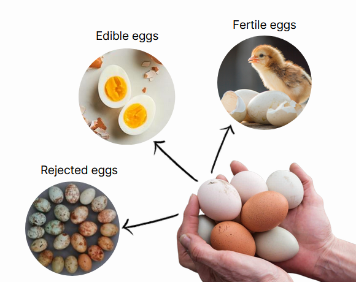

[comment]: # "This is the standard layout for the project, but you can clean this and use your own template"

# ML for Analyzing Egg Hatching

---

## Team
-  E/18/030, Aththanayake A.M.S., [email](mailto:e18030@eng.pdn.ac.lk)
-  E/18/282, Ranasinghe R.A.N.S., [email](mailto:e18282@eng.pdn.ac.lk)
-  E/18/283, Ranasinghe R.D.J.M., [email](mailto:e18283@eng.pdn.ac.lk)

## Table of Contents
1. [Introduction](#introduction)
2. [Problem and Solution](#problem-and-solution)
3. [Technology Stack](#technology-stack)
4. [Work Plan](#work-plan)
5. [Links](#links)

---

## Introduction

 The poultry industry faces significant challenges when it comes to the hatching process in breeder farms. Poultry farmers invest considerable resources and effort into incubating eggs, but the outcomes are often uncertain and unpredictable. This unpredictability leads to inefficiencies, economic losses, and compromised animal welfare. Additionally, the lack of accurate predictions regarding the number of eggs that will successfully hatch and the health of the resulting chicks hinders the ability of farmers to make informed decisions and optimize their breeding programs. Consequently, there is a pressing need to address these challenges and improve the overall hatching success rate in the poultry industry.

 

## Problem and Solution
We are going to offer a promising solution to the challenges faced by the poultry industry by predicting successful hatching eggs. By harnessing the power of machine learning algorithms, we can analyze a wide range of influential factors such as the age of parent chickens, feed amount, sex ratio and environmental conditions. These factors are crucial determinants of hatching success.

Through our project, we develop predictive models that can accurately forecast the number of eggs that will hatch successfully and predict the likelihood of producing healthy chicks. By leveraging historical data and identifying patterns and correlations, our models provide valuable insights to poultry farmers. Armed with this information, farmers can make data-driven decisions, optimize their breeding programs, and implement necessary interventions to maximize hatching success and chick health.

## Technology Stack

## Work Plan

## Links

- [Project Repository](https://github.com/cepdnaclk/{{ page.repository-name }}){:target="_blank"}
- [Project Page](https://cepdnaclk.github.io/{{ page.repository-name}}){:target="_blank"}
- [Department of Computer Engineering](http://www.ce.pdn.ac.lk/)
- [University of Peradeniya](https://eng.pdn.ac.lk/)

[//]: # (Please refer this to learn more about Markdown syntax)
[//]: # (https://github.com/adam-p/markdown-here/wiki/Markdown-Cheatsheet)
