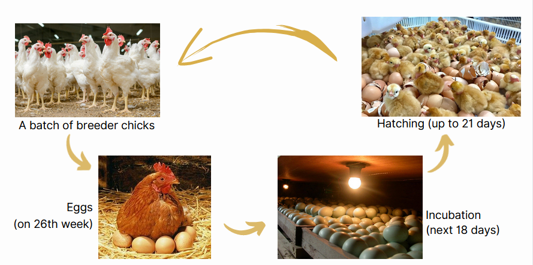
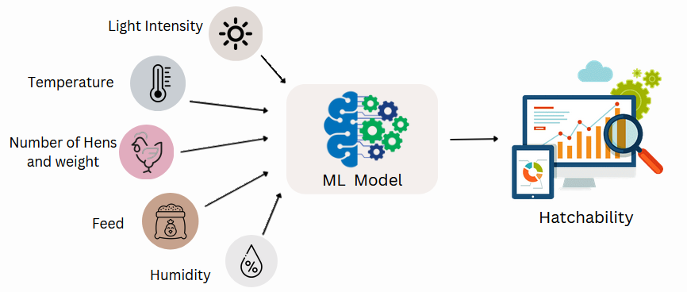
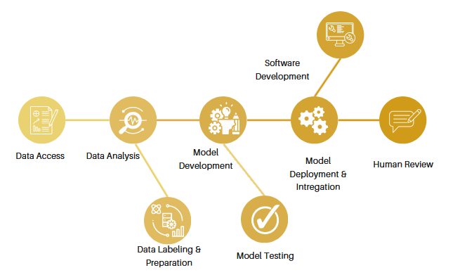

[comment]: # "This is the standard layout for the project, but you can clean this and use your own template"

# ML for Analyzing Egg Hatching

---

## Team
-  E/18/030, Aththanayake A.M.S., [email](mailto:e18030@eng.pdn.ac.lk)
-  E/18/282, Ranasinghe R.A.N.S., [email](mailto:e18282@eng.pdn.ac.lk)
-  E/18/283, Ranasinghe R.D.J.M., [email](mailto:e18283@eng.pdn.ac.lk)

## Table of Contents
1. [Introduction](#introduction)
2. [Problem and Solution](#problem-and-solution)
3. [Technology Stack](#technology-stack)
4. [Work Plan](#work-plan)
5. [Links](#links)

---

## Introduction

Egg hatching is a vast biological process that depends on various factors. The successful incubation of eggs plays a crucial role in the poultry industry. However, accurately determining the hatchability of eggs before they enter the incubation process remains a challenge for farmers. Currently, eggs are categorized based on their external appearance, but this method does not provide a definitive indication of whether an egg will hatch or not. As a result, farmers often face the risk of wasting valuable resources, such as incubation space and electricity, on eggs that will not successfully hatch.

 

## Problem and Solution
The inability to predict the hatchability of eggs before incubation leads to inefficiencies and economic losses for breeder farms. Eggs that are unlikely to hatch still occupy space within the incubators and consume electricity throughout the 21-day incubation period. Additionally, the uncertainty surrounding hatchability makes it difficult for farms to accurately supply the required daily demand. Therefore, there is a need for a reliable method to determine the likelihood of hatchability for eggs before they are placed in the incubators.

Implementing a machine learning (ML) model to predict egg hatchability offers significant benefits for breeder farms. By analyzing various factors and patterns related to egg characteristics and breeding conditions, the ML model can accurately determine the likelihood of an egg successfully hatching. This enables farmers to avoid wasting resources on eggs with low hatchability potential, optimizing incubation space and reducing electricity consumption. 

## Technology Stack

## Work Plan

## Links

- [Project Repository](https://github.com/cepdnaclk/{{ page.repository-name }}){:target="_blank"}
- [Project Page](https://cepdnaclk.github.io/{{ page.repository-name}}){:target="_blank"}
- [Department of Computer Engineering](http://www.ce.pdn.ac.lk/)
- [University of Peradeniya](https://eng.pdn.ac.lk/)

[//]: # (Please refer this to learn more about Markdown syntax)
[//]: # (https://github.com/adam-p/markdown-here/wiki/Markdown-Cheatsheet)
